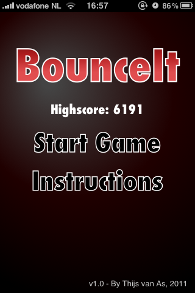
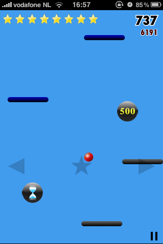
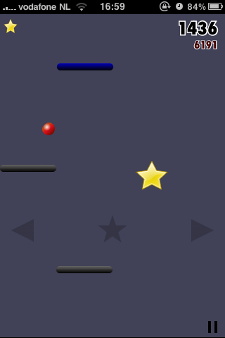
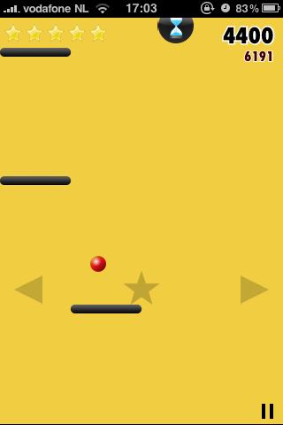

# BounceIt

BounceIt is an endless vertical jumper built in HTML5 that runs fully in the browser. It was inspired by [Doodle Jump](https://en.wikipedia.org/wiki/Doodle_Jump), which was topping the iPhone app charts at the time.

I built it in late 2010 right after [BrickIt](../brickit), reusing much of the same `<canvas>` "engine" and performance tuning tricks, and wrapped it up in January 2011.

Play BounceIt here: https://tvanas.nl/bounceit

## Features

- 4 types of power-ups (star boost, time delay, expanded platform, bonus points)
- 1 hazardous pickup (bomb that clears all platforms)
- Touch and keyboard controls
- Local high score saving
- Konami code 👀
- Originally installable to the iOS home screen and playable offline via AppCache (now removed from the HTML)

## Technical notes

- Single file implementation in `bounceit.js` inside the `net.pretopia.BounceIt` namespace  
- Pure HTML5 `<canvas>` rendering and vanilla pre-ES5 JavaScript, no frameworks or build tooling
- Built on the same core loop and rendering ideas as [BrickIt](../brickit), adapted for endless scrolling instead of fixed levels
- Originally written using `setInterval` and a tunable loop interval for per-device FPS optimizations, later updated to `requestAnimationFrame`
- Uses a precomputed sine-based `gravityLookup` table for the ball trajectory instead of recalculating physics every frame
- Background color is animated by cycling individual RGB channels over time for a subtle gradient effect
- Powerups use a global cooldown plus per-type cooldowns so boosts, slow motion, bombs and base platforms spawn at different rates as the run progresses
- Optional accelerometer control path exists for mobile devices, although in practice keyboard and touch controls gave a better experience
- Device-specific tuning for iPhone 3GS/4, iPad and early Android phones via different canvas sizes and parameter sets passed from `index.html` (platform width, speed, amplitude, etc.)

## Screenshots

### Menu (on iPhone 3GS)

### Gameplay (on iPhone 3GS)

