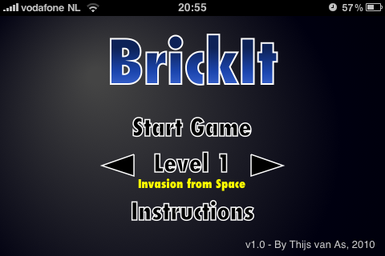
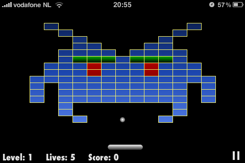
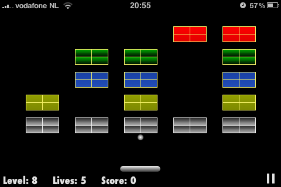
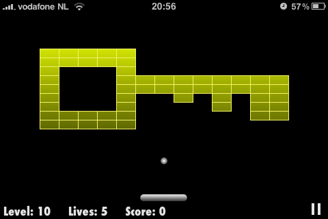

# BrickIt

BrickIt is an HTML5 breakout / Arkanoid style brick breaker that runs fully in the browser. I built it in 2010 to experiment with the then new `<canvas>` element.

In October 2010 BrickIt won second prize (USD $2,000) in Spil Games' html5contest.com, a monthly HTML5 [game contest](https://techcrunch.com/2010/08/31/spil-games-embraces-html5-to-take-its-casual-games-mobile-launches-developer-contest/).

Play BrickIt here: https://tvanas.nl/brickit

## Features

- 20 handcrafted levels
- Touch, mouse and keyboard controls
- 7 custom sound effects
- Local high score saving
- Originally installable to the iOS home screen and playable offline via AppCache (now removed from the HTML)

## Technical notes

- Single file implementation in `brickit.js` inside the `net.pretopia.BrickIt` namespace  
- Pure HTML5 `<canvas>` rendering and vanilla pre-ES5 JavaScript, no frameworks or build tooling
- Originally written using `setInterval` and a tunable `coreLoopInterval`, later adapted to `requestAnimationFrame`
- Game can be parameterized for resolution, brick sizes, pad speed, ball speed and more, which made it easier to target different devices and aspect ratios
- Uses vector graphics that scale cleanly across resolutions
- `index.html` contains per device tuning and user agent checks from 2010
- Designed and tested for:
  - iPhone 3GS and iPhone 4
  - iPad (with workarounds for the iOS 3.2 canvas text bug)
  - Early Android phones such as the HTC G1, HTC Desire and Motorola Droid
- iPhone 4 and iPad were new and came with much higher resolution screens. That meant 4x the pixels to fill compared to the iPhone 3GS, so a bunch of the work went into performance tuning for these devices.

## Screenshots

### Menu (on iPhone 3GS)
 

### Gameplay (on iPhone 3GS)

## Related

- In 2007 I built an Arkanoid clone in VHDL for an FPGA board: https://github.com/tvanas/arkanoid-vhdl
- The original html5contest.com submission included a short write up of the implementation and constraints: [docs/BrickIt_information_html5contest_20101031.pdf](docs/BrickIt_information_html5contest_20101031.pdf)
