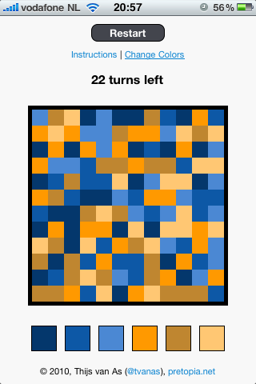
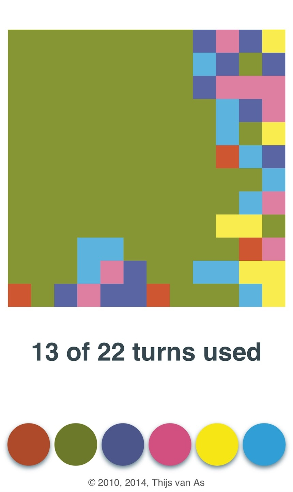

# FloodIt

FloodIt is a simple color flood puzzle game for the browser. It was the first JavaScript game I ever wrote (back in 2010), and building it taught me a lot of the basics I used in later projects.

Play FloodIt here: https://tvanas.nl/floodit

## Features

- 12x12 color grid with a fixed move limit
- Simple one tap/click controls
- Local high score saving
- Updated visuals in 2014 while keeping the original mechanics

## Technical notes

- Implemented in `floodit.js` inside the `net.pretopia.FloodIt` namespace
- Uses a DOM-based grid of `
` elements instead of `<canvas>`
- Supports configurable grid size and move limit via `main(numRowsCols, maxTurns, gameWidth)`, though the current UI always starts a 12x12 game with 22 moves
- Support for multiple color themes, though the 2014 update doesn't expose these anymore to simplify the experience
- Flood fill style expansion from the top-left cell on each move
- High scores stored via `localStorage`

## Screenshots

### 2010 styling on iPhone 3GS

### 2014 styling update

