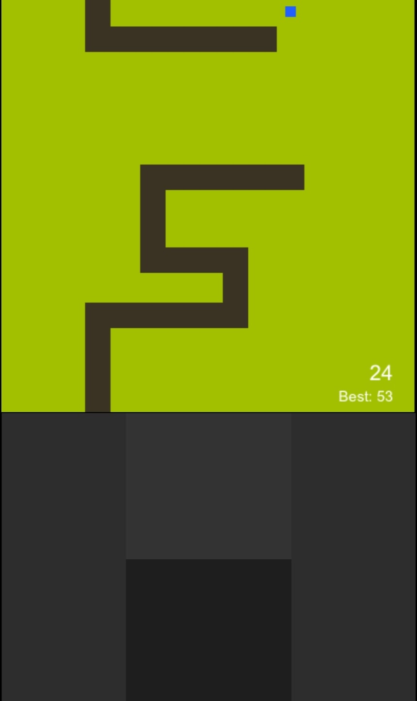

# SnakeIt

SnakeIt is a minimalist HTML5 homage to the [Snake](https://en.wikipedia.org/wiki/Snake_(1998_video_game)) game that shipped on early Nokia phones.

I wrote it in early 2017 after about six years of not coding. Most of the game came together during an intercontinental flight, using the same JavaScript habits I had back in 2010 even though the language had moved on quite a bit by then.

Play SnakeIt here: https://tvanas.nl/snakeit

## Features

- Classic Snake gameplay with growing tail and food pickups
- Wrap-around 15x15 grid (no walls)
- Simple early-2000s style visuals
- Keyboard controls on desktop, touch D-pad on mobile
- Local high score saving

## Technical notes

- Single-file implementation in `snakeit.js` with a simple bespoke game loop
- Pure HTML5 `<canvas>` and vanilla JavaScript, no frameworks or build tooling
- Grid automatically scales to fit the viewport, with a custom on-screen D-pad for mobile
- Snake body is stored as direction-encoded segments (H, V, corner types), rendered procedurally without sprites
- Buffered input system so quick successive turns are applied reliably even between movement ticks
- Leaner code compared to the earlier games in this repo

## Screenshots

### Gameplay (mobile)

