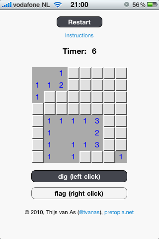
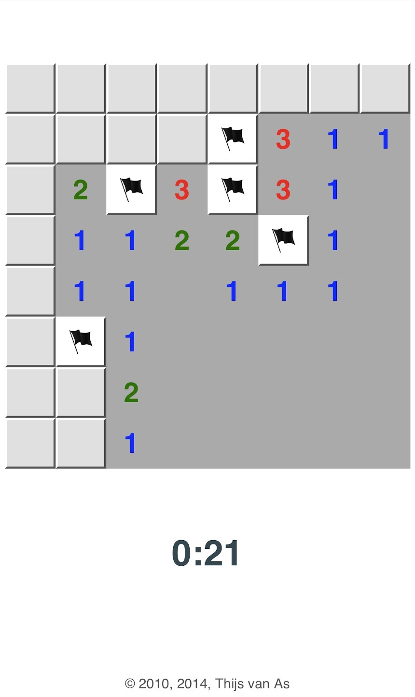

# SweepIt

SweepIt is a browser-based Minesweeper-style game written in vanilla JavaScript. I built it in 2010, right after [FloodIt](../floodit), reusing the same grid-based approach and expanding it into a full minefield with timing and high scores.

Play SweepIt here: https://tvanas.nl/sweepit

## Features

- Classic Minesweeper rules with randomly placed mines
- Timer-based scoring and local best-time tracking
- Click/tap to reveal, right click or long-press on mobile to place a flag
- Originally shipped with multiple difficulty levels (different grid sizes) in the 2010 version

## Technical notes

- Implemented in `sweepit.js` inside the `net.pretopia.SweepIt` namespace  
- Builds the board as a DOM grid of `
` elements, with custom styling for closed/open/flagged cells
- Uses `localStorage` to persist your personal best time
- 2014 refresh removed the old dig/flag toggle buttons in favor of long-press flagging on touch devices

## Screenshots

### 2010 styling on iPhone 3GS

### 2014 styling update

